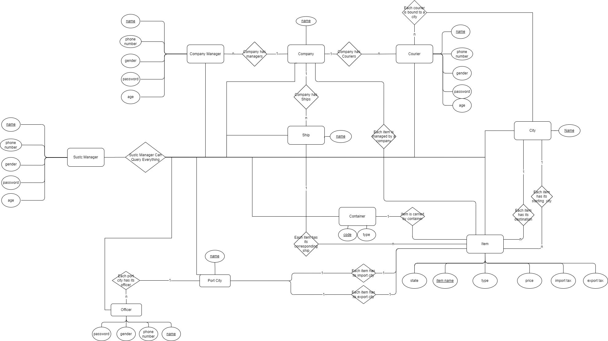
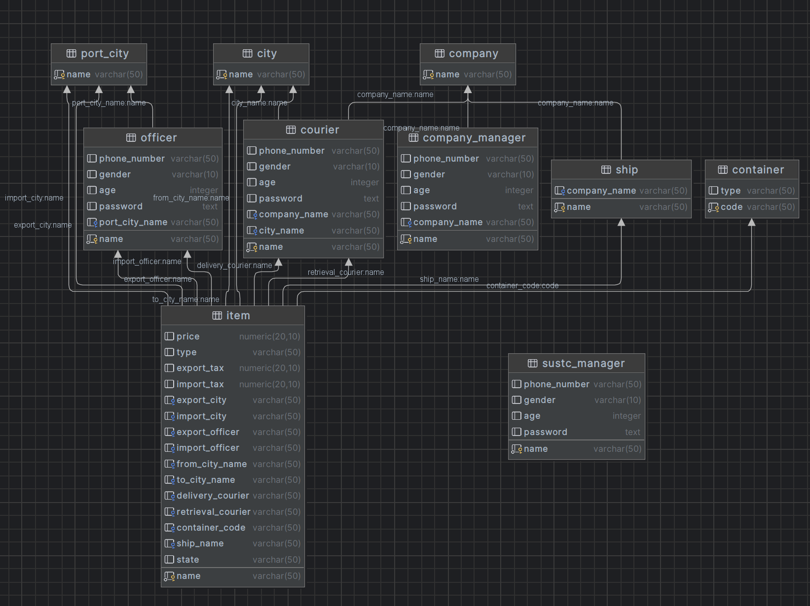

# Report of Database Principle Project II


## Members & Workload
|         Name         |     Student ID     |                         Contribution                         |     Ratio     |
| :------------------: | :----------------: | :----------------------------------------------------------: | :-----------: |
|  <br><br>Xuanyu Liu  | <br/><br/>12110408 | Database Design (Task 1) <br> SUSTC Manager Module (Task 2) <br> Courier Module (Task 3) <br> Backend Module (Advanced Task) <br> Report Writing | <br/><br/>50% |
| <br/><br/>Zexin Feng | <br/><br/>12110104 | Table Manipulation Module (Task 2)<br>Company Manager Module (Task 2)<br>Seaport Officer Module (Task 2)<br> Client Module (Advanced Task)<br>Report Writing | <br/><br/>50% |


## Database Design
We design our database on the base of project I. All related SQLs are in `sql` directory.

### ER Map


### Tables Diagram


### Database User Creation
SQL:
```sql
DROP USER IF EXISTS courier,officer,company_manager,sustc_manager;
CREATE USER courier PASSWORD 'courier_password';
CREATE USER officer WITH PASSWORD 'officer_password';
CREATE USER company_manager WITH PASSWORD 'company_manager_password';
CREATE USER sustc_manager WITH PASSWORD 'sustc_manager_password';
```
We create four database users naming `courier` `officer` `company_manager` `sustc_manager` which correspond to four entities of SUSTC.

### Permission Granting
SQL:
```sql
GRANT SELECT, UPDATE ON TABLE item,courier TO courier;
GRANT INSERT ON TABLE item,port_city,city,ship,container TO courier;
GRANT SELECT, UPDATE ON TABLE item,officer TO officer;
GRANT SELECT ON TABLE ship TO company_manager;
GRANT SELECT, UPDATE ON TABLE item,company,company_manager TO company_manager;
GRANT SELECT ON TABLE city,company,company_manager,container,courier,item,officer,port_city,ship,sustc_manager TO sustc_manager;
```
Because while executing `newItem()` method, there may be some new cities, ships or containers which may not exist in the system, so we grant `insert` permission to courier.

No special description for other users.  

## Basic API Implementation

### Table Manipulation

#### Constructor(String database, String root, String pass);

The constructor first connect to the database with use opened source script runner to run the SQL files to create the table for items and employees.  Then add a listener to listen the shut down event then drop all the table and users

**sql example:**

```sql
CREATE TABLE IF NOT EXISTS item
(
    name              varchar(50) primary key,
    price             numeric(20, 10),
    type              varchar(50),
    export_tax        numeric(20, 10),
    import_tax        numeric(20, 10),
    export_city       varchar(50) references port_city,
    import_city       varchar(50) references port_city,
    export_officer    varchar(50) references officer (name),
    import_officer    varchar(50) references officer (name),
    from_city_name    varchar(50) references city (name),
    to_city_name      varchar(50) references city (name),
    delivery_courier  varchar(50) references courier (name),
    retrieval_courier varchar(50) references courier (name),
    container_code    varchar(50) references container (code),
    ship_name         varchar(50) references ship (name),
    state             varchar(50)
);
```

**shut down listener**

```java
class BeforeEnd {
    BeforeEnd() {
        Thread t = new Thread(() -> {
            try {
                System.out.println("Processing Last Tasks...");
                Connection con = ConnectionManager.getRootConnection();
                Util.dropTableAndUsers(con);
                ConnectionManager.closeAllConnection();
                System.out.println("end...");
            } catch (Exception e) {
                e.printStackTrace();
            }
        });
        Runtime.getRuntime().addShutdownHook(t);
    }
}
```

#### void import(String recordsCSV, String staffsCSV);

The multiple threads loader we are using is what we designed in Project 1. Script runner and loaders are all in the path `src/main/Loaders/`. We wrote a report about our loader in Project 1 already. We disabled all the trigger and load into each table with a new thread to avoid dead lock.

### SUSTC Department Manager User

#### [Pre Operation] Identity Check
This is the pre operation of all the following methods. If identity check fails, all the successive procedures won't execute but return the value defined in project document immediately.
```sql
SELECT * FROM sustc_manager WHERE  name = ? AND password = ?
```
Query the user with corresponding username and password. If the result is not null, then login successfully.

Because we don't add salt to password while storing even with encryption, so we can still use the hashed password to get the user with the same sql, other than get the user from database first then check the correctness of his password.

#### int getCompanyCount(LogInfo log);
SQL:
```sql
SELECT count(*) as company_count FROM company;
```
The sql is simple enough and no need for explanation.

#### int getCityCount(LogInfo log);
SQL:
```sql
SELECT count(*) as city_count FROM (select name from city union select name from port_city) as cities;
```
Because we store the cities with different types in different tables, so we have to use `union` to get get all the cities without duplication, then count the number.

#### int getCourierCount(LogInfo log);
SQL:
```sql
SELECT count(*) as courier_count FROM courier;
```
The sql is simple enough and no need for explanation.

#### int getShipCount(LogInfo logInfo);
```sql
SELECT count(*) as ship_count FROM ship;
```
The sql is simple enough and no need for explanation.

#### ItemInfo getItemInfo(LogInfo logInfo, String name);
SQL:
```sql
SELECT * FROM item where item.name = ?;
```
Query the item with specific name. If the result is not null, then transform it into ItemInfo and return, else return null.

#### getShipInfo(LogInfo logInfo, String name);
SQL1:
```sql
SELECT * from ship where ship.name = ?;
```
Query the ship with specific name. If the ship doesn't exist, return null.

SQL2:
```sql
SELECT count(*) as count FROM item where item.ship_name = ? AND item.state = 'Shipping';
```
Query count of items on this ship whose state is `Shipping`. If the count is greater than 1, the ship is `Sailing`, else the ship is not `Sailing`.


#### ContainerInfo getContainerInfo(LogInfo logInfo, String code);
SQL1:
```sql
SELECT * FROM container where container.code = ?;
```
Query the container with specific name. If the container doesn't exist, return null.

SQL2:
```sql
SELECT count(*) from item where item.container_code = ? AND item.state != 'Finish';
```
Query count of containers carried by this container whose state is not `Finish`. If the count is greater than 1, the container is `using`, else the container is not `using`.

#### StaffInfo getStaffInfo(LogInfo logInfo, String name);
SQL:
```sql
SELECT name,
       phone_number,
       gender,
       age,
       company_name,
       city_name,
       'Courier' as role,
       password
FROM courier
WHERE courier.name = ?
UNION
SELECT name,
       phone_number,
       gender,
       age,
       company_name,
       null             as city_name,
       'CompanyManager' as role,
       password
FROM company_manager
WHERE company_manager.name = ?
UNION
SELECT name,
       phone_number,
       gender,
       age,
       null           as company_name,
       null           as city_name,
       'SustcManager' as role,
       password
from sustc_manager
WHERE sustc_manager.name = ?
UNION
SELECT name,
       phone_number,
       gender,
       age,
       null             as company_name,
       port_city_name   as city_name,
       'SeaportOfficer' as role,
       password
FROM officer
WHERE officer.name = ?
```
Because we store staffs with different roles in different tables, so we have to query the four tables one by one, the use `union` to gather the query result.

### Courier
#### [Pre Operaton] Identity Check
This is the pre operation of all the following methods. If identity check fails, all the successive procedures won't execute but return the value defined in project document immediately.
```sql
SELECT * FROM courier WHERE  name = ? AND password = ?
```
Query the user with corresponding username and password. If the result is not null, then login successfully.

#### boolean newItem(LogInfo logInfo, ItemInfo itemInfo);
**Firstly**, we execute basic data validation:

Java:
```java
// check illegal field
            if (itemInfo.name() == null || itemInfo.$class() == null || itemInfo.price() < 0 ||
                    itemInfo.retrieval() == null || itemInfo.retrieval().city() == null ||
                    itemInfo.delivery() == null || itemInfo.delivery().city() == null || itemInfo.export() == null || itemInfo.export().city() == null ||
                    itemInfo.export().tax() < 0 || itemInfo.$import().city() == null || itemInfo.$import().tax() < 0)
                return false;

// courier is current user
if (itemInfo.retrieval().courier() != null && !itemInfo.retrieval().courier().equals(logInfo.name())) {
    return false;
}

// state must be null
if (itemInfo.state() != null) {
    return false;
}

// check whether the import city is different from export city and delivery city is different from retrieval city
if (itemInfo.export().city().equals(itemInfo.$import().city()) || itemInfo.retrieval().city().equals(itemInfo.delivery().city())) {
    return false;
}
```

**Secondly**, we check whether the item exists.

SQL:
```sql
SELECT * from item where name = ?;
```
If the query result is null, the item doesn't exist, return null.


**Thirdly**, check whether the tax rate is correct.

SQL:
```sql
SELECT import_tax, price from item where type = ? and import_city = ? limit 1;
SELECT export_tax, price from item where type = ? and export_city = ? limit 1;
```
We use those two SQLs to query the existing record in our system, and calculate the import tax rate and output tax rate. If either tax rate of the new item doesn't match our existing record, return false.

_Note: To avoid rounding error, we set the threshold of mismatch to `0.0001`. That is to say, if the difference of two numbers is less than `0.0001`, we think they are equal._


**Fourthly**, we check whether the retrieval city is where the courier works.

SQL:
```sql
SELECT city_name from courier where courier.name = ?;
```
We use this SQL to query the working city of the courier. If it doesn't match the retrieval city of the item, return false.

**Fifthly**, we record the cities if them don't exist in our system.
```sql
INSERT INTO city (name) VALUES (?) ON CONFLICT DO NOTHING;
INSERT INTO port_city(name) values (?) ON CONFLICT DO NOTHING;
```

**Finally**, we record the item into our system.
```sql
INSERT INTO item(name, price, type, export_tax, import_tax, export_city, import_city, from_city_name, to_city_name, retrieval_courier, state) VALUES (?, ?, ?, ?, ?, ?, ?, ?, ?, ?, ?)
```


#### boolean setItemState(LogInfo logInfo, String itemName, ItemState itemState);

First, we get the existing record of the item in our system. If the item doesn't exist, return false.

SQL:
```sql
SELECT * FROM  item where item.name = ?;
```
Then, we perform series of judge on whether the item can be set to the new state. If the item needs to updates its delivery courier, we perform an additional check on whether the delivery city is where the delivery courier works. If the item doesn't pass our check, return false.

The following SQL is used to query the working city of the courier.
```sql
SELECT city_name from courier where courier.name = ?;
```

Finally, if the item need to update its state, we perform such a SQL:
```sql
UPDATE item SET state = ? where item.name = ?;
```

If the item need to update its delivery courier, we perform following SQL:
```sql
UPDATE item SET delivery_courier = ? WHERE  item.name = ?;
```

### Company Manager User

#### double getImportTaxRate(LogInfo log, String city, String itemClass);

We use sql to select specific type of item in import city and return the value tax/price.

```sql
SELECT import_tax, price from item where type = ? and import_city = ? limit 1
```

#### double getExportTaxRate(LogInfo log, String city, String itemClass)

same as above

#### bool loadItemToContainer(LogInfo log, String itemName, String containerCode);

First we check the permission of this manager, first we use sql check if the item exist or not, then we get the company of manager, and get the company of item from the retrieval courier of item. Then check the usage of container and if the item state correct or not.

```sql
//check existing & get item state
SELECT * from item where name = ?
//check company
SELECT * from courier where name = ?	//name from fisrt sql
SELECT * from company_manager where name = ?
//check container
SELECT * FROM item WHERE container_code = ? and ( state = ? or state = ? or state = ?)		//state between packing and unpacking
```

If the operation is valid. we update item's container code

```sql
UPDATE item SET container_code = ? WHERE name = ?
```

#### bool loadContainerToShip(LogInfo log, String shipName, String containerCode);

We check if the ship is ready or not by select the item which is shipping with corresponding ship. Then check if the container is ready for load or not (valid state and didn't load to any ship). After all check if the manager have the permission just like we did above.

```sql
//check ship
SELECT * FROM item WHERE ship_name = ? and ( state = ? )
//check if item exist and ready
SELECT * FROM item WHERE container_code = ? and state = ? and (ship_name = '' or ship_name is null)
//check permission
SELECT * from courier where name = ?	//name from fisrt sql
SELECT * from company_manager where name = ?
SELECT * from ship where name = ?
```

If the operation is valid. we update item's ship name and state

```sql
UPDATE item SET ship_name = ?, state = ?  WHERE name = ?
```

#### bool shipStartSailing(LogInfo log, String shipName);

We check if the ship is sailing by select the item which has the ship name and state is shipping. If it is exist, then ship is using. Then check is permission of manager by the same way above.

```sql
SELECT * FROM item WHERE ship_name = ? and ( state = ? )
```

Then, we make a list which contains the item on this ship, and update their state to shipping.

```sql
SELECT * FROM item WHERE state = ? and ship_name = ?
//for all item above
UPDATE item SET state = ? where name = ?
```

#### bool unloadItem(LogInfo log, String item);

First check is existing of item, then the permission of manager, finally the state of item

```sql
SELECT * FROM item WHERE name = ? and state = ?
```

Then update the item state

```sql
UPDATE item SET state = ? WHERE name = ?
```

#### bool itemWaitForChecking(LogInfo log, String item);

First check is existing of item, then the permission of manager, finally the state of item

```sql
SELECT * FROM item WHERE name = ? and state = ?
```

Then update the item state

```sql
UPDATE item SET state = ? WHERE name = ?
```

### Seaport Officer User

#### String[] getAllItemsAtPort(LogInfo log);

First we check the city of current officer

```sql
SELECT * FROM officer WHERE name = ?
```

Then we select all the item which is wait for export/import checking in this ciry

```sql
SELECT name FROM item WHERE (export_city = ? and state = ?) or (import_city = ? and state = ?)
```

And return it as an array.

#### bool setItemCheckState(LogInfo log, String itemName, bool success);

First we check is existing of item and the item state. Set item state to different state by export/import checking

```java
switch (state) {
    default -> {
        return false;
    }
    case 3 -> {
        if(!Util.getOfficerCity(logInfo.name()).equals(Util.getItemExportCity(itemName))) return false;
        if (success) {
            Util.setItemState(itemName, 4, getConnection());
        } else {
            Util.setItemState(itemName, 12, getConnection());
        }
        Util.setItemExportOfficer(itemName, logInfo.name());
    }
    case 8 -> {
		if(!Util.getOfficerCity(logInfo.name()).equals(Util.getItemImportCity(itemName))) return false;
        if (success) {
            Util.setItemState(itemName, 9, getConnection());
        } else {
            Util.setItemState(itemName, 13, getConnection());
        }
        Util.setItemImportOfficer(itemName, logInfo.name());
    }
}
```

## Adcanced Task

### Backend
#### Introduction
We build a web server as our backend program, and communicate with frontend program using `HTTP`/`HTTPS` protocol.

Instead of using `Tomcat` or `Spring MVC`, we implement our backend program using a tiny concise framework `Spark`, which has similar usage of `Flask` (a python web framework). What's more, we use `Gson` library to construct response in `json` format for some complex requests.


#### Program Structure
The backend program locates in `src/main/Backend` directory. The program structure is as follows.
```
📦Backend
 ┣ 📜AuthHandler.java
 ┣ 📜BackendServer.java
 ┣ 📜CompanyManagerHandler.java
 ┣ 📜CourierHandler.java
 ┣ 📜SeaportOfficerHandler.java
 ┗ 📜SustcManagerHandler.java
```
`BackendServer.java`: The main file of program, which is runnable. Requests come from frontend are processed by this file at first, then be dispatched to corresponding handlers.

`XXXXHandler.java`: The request handlers of different roles. Those files are which the program actually processes the request.

#### How to Run?
1. Change the database connection infomation at the first line of  `main()` method.
2. Run `BackendServer.java` directly. Our program will automatically initialize database and import data.

#### API Provided
All the available APIs are declared in `BackendServer.java` as follows.

We all the APIs listed in `Basic API Implementation` part are mapped here. Besides, we provide an extra `/login` api out of convenience.
```java
        post("/login", AuthHandler::login);
        get("/sustc_manager/company_count", SustcManagerHandler::getCompanyCount);
        get("/sustc_manager/city_count", SustcManagerHandler::getCityCount);
        get("/sustc_manager/courier_count", SustcManagerHandler::getCourierCount);
        get("/sustc_manager/ship_count", SustcManagerHandler::getShipCount);
        get("/sustc_manager/item_info/:name", SustcManagerHandler::getItemInfo);
        get("/sustc_manager/ship_info/:name", SustcManagerHandler::getShipInfo);
        get("/sustc_manager/container_info/:code", SustcManagerHandler::getContainerInfo);
        get("/sustc_manager/staff_info/:name", SustcManagerHandler::getStaffInfo);


        post("/courier/new_item", CourierHandler::newItem);
        post("/courier/set_item_state", CourierHandler::setItemState);

        get("/officer/get_all_items_at_port", SeaportOfficerHandler::getAllItemsAtPort);
        post("/officer/set_item_check_state", SeaportOfficerHandler::setItemCheckState);

        get("/company_manager/get_import_tax_rate/:city/:item_class", CompanyManagerHandler::getImportTaxRate);
        get("/company_manager/get_export_tax_rate/:city/:item_class", CompanyManagerHandler::getExportTaxRate);
        post("/company_manager/load_item_to_container", CompanyManagerHandler::loadItemToContainer);
        post("/company_manager/load_container_to_ship", CompanyManagerHandler::loadContainerToShip);
        post("/company_manager/ship_start_sailing", CompanyManagerHandler::shipStartSailing);
        post("/company_manager/unload_item", CompanyManagerHandler::unloadItem);
        post("/company_manager/item_wait_for_checking", CompanyManagerHandler::itemWaitForChecking);
```

#### Authentication
All APIs except `/login` no matter using GET or POST method are required to contain credentials in request header:
```json
{
    "username": "xxxxx",
    "password": "xxxxx",
    "role":     "xxxxx"
}
```

#### Detailed Information
Please turn to API's corresponding `handler` to get detailed information. For every API provided, we have showed the format of its requests and example of response at the comments. For example, you can get the detailed information of `/courier/new_item` at `CourierHandler`:
```java
    /**
     * @url /courier/new_item
     * @Header username String
     * @Header password String
     * @Header role     String
     * @Method Post
     * @RequestParam from_city          String
     * @RequestParam to_city            String
     * @RequestParam retrieval_courier  String
     * @RequestParam delivery_courier   String
     * @RequestParam export_city        String
     * @RequestParam export_officer     String
     * @RequestParam export_tax         float
     * @RequestParam import_city        String
     * @RequestParam import_officer     String
     * @RequestParam import_tax         float
     * @RequestParam name               String
     * @RequestParam class              String
     * @RequestParam price              float
     * @Response String
     * @ResponseExmaple true
     */
    public static String newItem(Request request, Response response);
```

### Client

ui:

login

```python
print("============================================================")
print("|                         [Login]                          |")
print("|         Please Enter Number To Select Your Role          |")
print("|----------------------------------------------------------|")
print("|  1. Courier      2. Company Manager   3. Seaport Officer |")
print("|  4. SUSTCManager                      Q. Exit            |")
print("============================================================")
```

Then input username and password:

```python
	print("============================================================")
    print("|                        [Login]                           |")
    print("|        Please Enter Your Username and Password           |")
    print("============================================================")
    print(info)
    print(">>> Username: ", end="")
    username = input()
    passwd = getpass(prompt=">>> Password: ")
    r = requests.post(urljoin(config['base'], '/login'), data={
        "username": username,
        "role": role,
        "password": passwd
    })
    result = r.json()
    if (result):
        print("              =============================              ")
        print("              |    Login Successfully!    |              ")
        print("              =============================              ")
        time.sleep(1)
        success = True
    else:
        print("<Wrong Username or Password!>")
        time.sleep(1)
        success = False
    
    return username, passwd, role, success
```

Next is operations

For example sustc manager:

```python
print("============================================================")
print("|                       [Operations]                       |")
print("|      Please Enter Number To Select Your Operation        |")
print("|----------------------------------------------------------|")
print("|                   1. Get Company Count                   |")
print("|                     2. Get City Count                    |")
print("|                   3. Get Courier Count                   |")
print("|                     4. Get Ship Count                    |")
print("|                     5. Get Item Info                     |")
print("|                     6. Get Ship Info                     |")
print("|                   7. Get Container Info                  |")
print("|                     8. Get Staff Info                    |")
print("|----------------------------------------------------------|")
print("|          X. Log Out                     Q. Quit          |")
print("============================================================")
```

We then use `requests` module to send http request to back end

for example (get city count):

```python
def company_count(username, passwd):
    result = requests.get(urljoin(config['base'], '/sustc_manager/company_count'), headers={
        'username': username,
        'password': passwd,
        'role': role
    }).json()
    if result != -1:
        print("Company Count: {0}".format(result))
    else:
        print("Failed!")
    input("Press Enter to continue...")

```

That's all, thanks